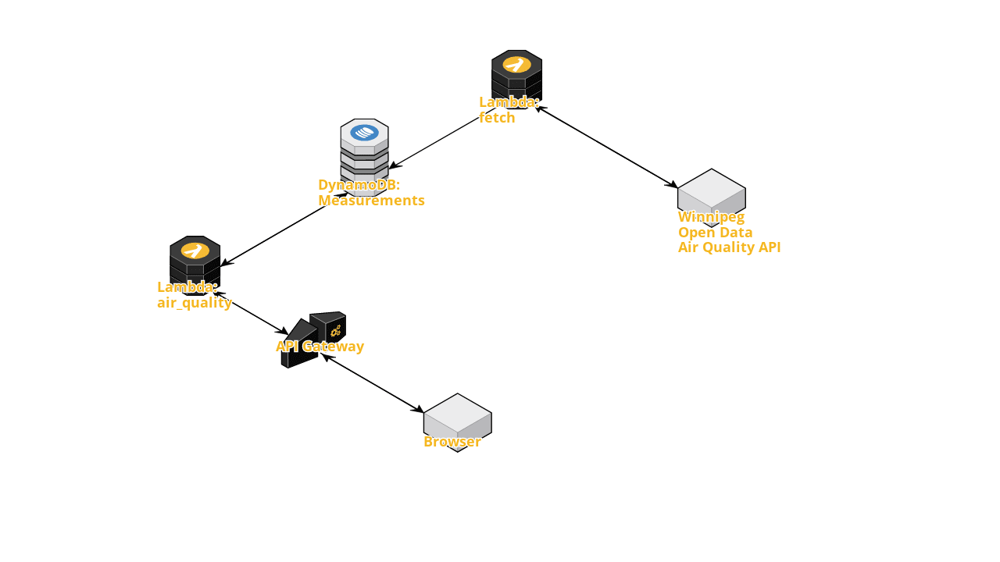

# Winnipeg Air Quality

This project is mainly just for me to try out [Serverless Framework](https://github.com/serverless/serverless)
as a way to manage Lambda code deployments and AWS infrastructure.

## Overview

Winnipeg provides [an API](https://data.winnipeg.ca/Organizational-Support-Services/Air-Quality/f58p-2ju3) to retrieve air quality data. It takes quite a few API calls to retrieve all the air quality measurements using Winnipeg's API and this is pretty slow. Querying this API regularly and saving the results in our DynamoDB table lets us retrieve this information much faster when we need it. 

The `fetch` Lambda function runs every 15 minutes and queries Winnipeg's air quality API. The measurements retrieved are stored in a DynamoDB table.

Another Lambda function `air_quality_map` queries the DynamoDB table and displays the latest readings on a map.

Results on map: https://winnipegairquality.com/

Raw JSON: https://winnipegairquality.com/raw

## Architecture Diagram

